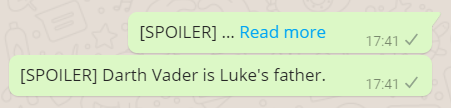

# WhatsApp Spoilers
Send WhatsApp messages with spoiler tags!

## About

If a message is longer than a certain limit, WhatsApp clients will truncate it
and show a "Read more" link instead. By padding a message with 4000 [zero-width
joiners](https://en.wikipedia.org/wiki/Zero-width_joiner), we can force this
behaviour and emulate a spoiler tag.

I Just Tried This! I am still a learner am currently at the beginning stage of coding.

## Credits
# Soumyadeep Dey ⚡🔥
